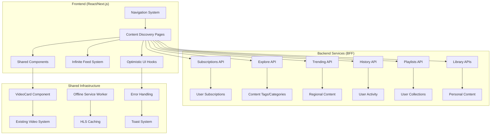
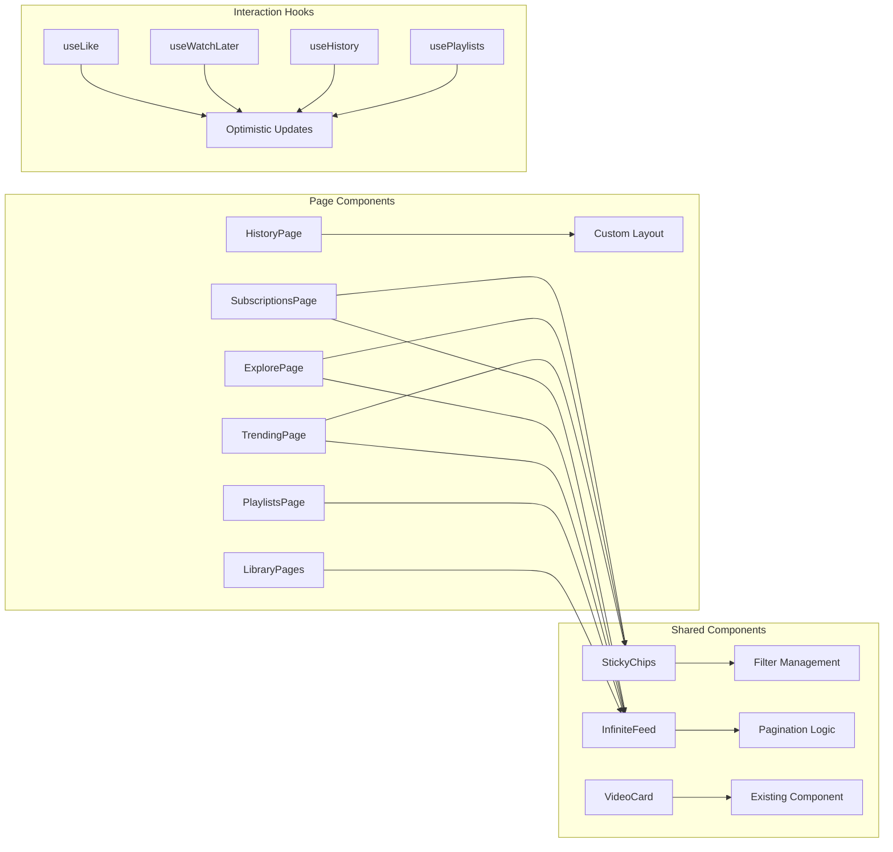

# Content Discovery Platform Design

## Overview

The Content Discovery Platform extends the existing streaming application with comprehensive content exploration, personal library management, and user engagement features. The system provides YouTube-like functionality including subscriptions, trending content, viewing history, playlists, and personal video libraries while maintaining consistency with existing components and ensuring optimal performance.

The platform is built on React 18 with Next.js App Router, TypeScript, Tailwind CSS, and @tanstack/react-query for state management. It integrates seamlessly with the existing video infrastructure while adding new discovery and organization capabilities.

## Architecture

### High-Level System Architecture



### Component Architecture



## Components and Interfaces

### Core Shared Components

#### StickyChips Component
- **Purpose**: Reusable filter chip interface that remains visible during scroll
- **Key Features**:
  - Sticky positioning with proper z-index layering
  - Active state management with visual feedback
  - Horizontal scrolling for mobile responsiveness
  - Consistent styling across all discovery pages
  - Accessibility support with ARIA attributes

```typescript
interface Chip {
  id: string;
  label: string;
  value: string;
}

interface StickyChipsProps {
  chips: Chip[];
  active: string;
  onChange: (value: string) => void;
}
```

#### InfiniteFeed Component
- **Purpose**: Reusable infinite scrolling grid with loading states
- **Key Features**:
  - Intersection Observer for performance-optimized loading
  - Integration with @tanstack/react-query infinite queries
  - Skeleton loading states during initial load
  - Error handling with retry mechanisms
  - Responsive grid layout (2 cols mobile, 4 cols desktop)
  - Virtualization support for very large datasets

```typescript
interface PageResponse {
  items: Video[];
  nextPage?: number;
}

interface InfiniteFeedProps {
  queryKey: any[];
  fetchPage: (page: number) => Promise<PageResponse>;
  renderError?: (error: Error, retry: () => void) => React.ReactNode;
}
```

### Discovery Page Components

#### SubscriptionsPage
- **Purpose**: Display content from subscribed creators with time filtering
- **Key Features**:
  - Time-based filtering (All/Today/This week)
  - Integration with existing VideoCard component
  - Empty state for users with no subscriptions
  - Cache invalidation strategy for fresh content

#### ExplorePage
- **Purpose**: Content discovery through tag-based filtering
- **Key Features**:
  - Dynamic tag fetching with fallback categories
  - Tag-based content filtering
  - Graceful degradation when API is unavailable
  - Caching strategy for public content

#### TrendingPage
- **Purpose**: Regional trending content with time windows
- **Key Features**:
  - Region selection dropdown
  - Time window filtering (Now/24h/This week)
  - Default region from environment configuration
  - Fallback handling for region API failures

### Personal Library Components

#### HistoryItem Component
- **Purpose**: Individual history entry with progress tracking
- **Key Features**:
  - Video thumbnail with duration overlay
  - Progress bar showing watch completion
  - Watch timestamp display
  - Individual item removal functionality
  - Responsive layout for mobile and desktop

#### PlaylistCard Component
- **Purpose**: Playlist overview card for grid display
- **Key Features**:
  - Cover image with fallback
  - Video count and last updated information
  - Navigation to playlist detail page
  - Consistent styling with other content cards

#### UploadRow Component
- **Purpose**: Creator video management in table format
- **Key Features**:
  - Video thumbnail and metadata display
  - Status indicators (processing, live, published)
  - View count and performance metrics
  - Action buttons for video management

### Interaction and State Management

#### Optimistic UI Hooks

**useLike Hook**
- **Purpose**: Immediate like/unlike feedback with API synchronization
- **Key Features**:
  - Optimistic state updates for instant feedback
  - Error handling with state reversion
  - Idempotency key generation for safe retries
  - Toast notifications for error states

**useWatchLater Hook**
- **Purpose**: Save/remove videos from watch later list
- **Key Features**:
  - Optimistic updates with error recovery
  - API integration for persistence
  - Idempotency for safe operations
  - User feedback through toast system

## Data Models

### Video Model (Extended)
```typescript
interface Video {
  id: string;
  title: string;
  hlsUrl: string;
  poster: string;
  durationSec: number;
  durationLabel: string;
  views: number;
  age: string;
  creator: {
    id: string;
    handle: string;
  };
  // Extended for discovery features
  liked?: boolean;
  watchLater?: boolean;
  watchProgress?: number;
}
```

### Playlist Model
```typescript
interface Playlist {
  id: string;
  title: string;
  videoCount: number;
  updatedAt: string;
  cover?: string;
  items?: Video[];
}
```

### History Item Model
```typescript
interface HistoryItem {
  id: string;
  video: Video;
  watchedAt: string;
  progressPct: number;
}
```

### Upload Status Model
```typescript
interface UploadItem {
  video: Video;
  status: 'processing' | 'live' | 'published' | 'failed';
  views: number;
  uploadedAt: string;
}
```

## Error Handling

### Optimistic Update Recovery
- **Strategy**: Immediate UI updates with background API calls
- **Implementation**: State reversion on API failure with user notification
- **User Experience**: Toast notifications for failed operations with retry options

### Network Resilience
- **API Failures**: Graceful degradation with retry mechanisms
- **Loading States**: Skeleton screens during data fetching
- **Empty States**: Helpful messaging and suggested actions

### Error Boundary Integration
- **Component-Level**: Error boundaries for each major page section
- **Recovery**: Automatic retry for transient failures
- **Fallbacks**: Graceful degradation to basic functionality

## Performance Optimization

### Caching Strategy

**Personalized Content** (cache: "no-store")
- Subscriptions feed
- Viewing history
- Liked videos
- Watch later list
- Personal playlists

**Public Content** (with caching)
- Explore content (30-second stale time)
- Trending videos (30-second stale time)
- Tag lists (5-minute stale time)
- Region lists (1-hour stale time)

### Image Optimization
- **Lazy Loading**: All video thumbnails use loading="lazy"
- **Responsive Images**: Multiple sizes for different viewport widths
- **Fallback Handling**: Graceful degradation for failed image loads
- **Preloading**: Above-the-fold images loaded immediately

### Infinite Scroll Performance
- **Intersection Observer**: Efficient scroll detection with 600px margin
- **Virtualization**: Optional react-virtual integration for very large lists
- **Debouncing**: Prevent excessive API calls during rapid scrolling
- **Memory Management**: Automatic cleanup of off-screen components

## Offline Functionality

### Service Worker Integration
- **HLS Caching**: Manifest and segment caching for offline playback
- **Selective Caching**: User-initiated downloads only
- **Storage Management**: Automatic cleanup of old cached content
- **Fallback Handling**: Graceful degradation when offline

### Download Management
- **User Interface**: Simple download/remove toggle buttons
- **Progress Tracking**: Visual feedback during download process
- **Storage Limits**: Respect browser storage quotas
- **Cleanup**: User-initiated removal of cached content

## Security Considerations

### API Security
- **Idempotency Keys**: Prevent duplicate operations during retries
- **Authentication**: JWT-based authentication for personal content
- **Rate Limiting**: Client-side throttling for API calls
- **Input Validation**: Sanitization of user-generated content

### Privacy Protection
- **History Management**: User control over viewing history
- **Data Minimization**: Only collect necessary user data
- **Consent Management**: Clear user consent for data collection
- **Secure Storage**: Encrypted storage for sensitive user data

## Accessibility

### Keyboard Navigation
- **Focus Management**: Proper tab order for all interactive elements
- **Keyboard Shortcuts**: Standard shortcuts for common actions
- **Screen Reader Support**: ARIA labels and descriptions
- **High Contrast**: Support for high contrast mode

### Visual Accessibility
- **Color Contrast**: WCAG AA compliance for all text
- **Font Scaling**: Responsive to user font size preferences
- **Motion Reduction**: Respect prefers-reduced-motion settings
- **Alternative Text**: Descriptive alt text for all images

## Integration Points

### Existing Component Reuse
- **VideoCard**: Consistent video display across all pages
- **Header/Navigation**: Integration with existing navigation system
- **Player**: Seamless integration with existing video player
- **Styling**: Consistent with existing design system

### API Integration
- **BFF Endpoints**: RESTful API integration with existing backend
- **Error Handling**: Consistent error response handling
- **Authentication**: Integration with existing auth system
- **Caching**: Coordination with existing caching strategies

## Deployment Considerations

### Environment Configuration
- **API Endpoints**: Configurable base URLs for different environments
- **Feature Flags**: Runtime enabling/disabling of features
- **Regional Settings**: Default region configuration
- **Performance Monitoring**: Integration with existing analytics

### Monitoring and Analytics
- **User Engagement**: Track content discovery patterns
- **Performance Metrics**: Monitor page load times and scroll performance
- **Error Tracking**: Comprehensive error logging and alerting
- **Usage Analytics**: Content popularity and user behavior insights

### Scalability
- **Component Architecture**: Modular design for easy maintenance
- **Code Splitting**: Lazy loading of discovery features
- **Bundle Optimization**: Minimize JavaScript bundle size
- **CDN Integration**: Efficient asset delivery through CDN