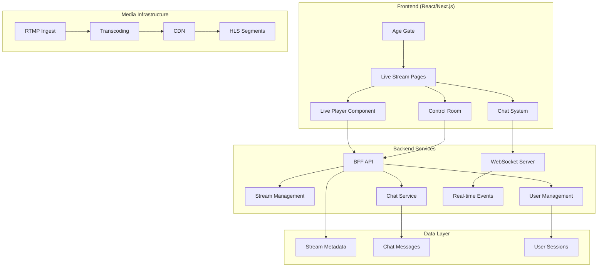
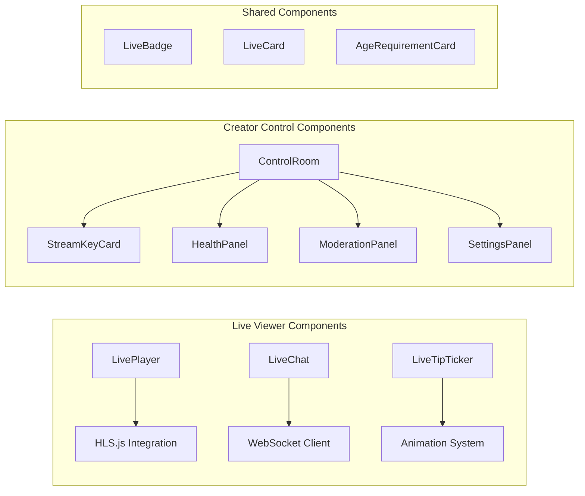

# Live Streaming Platform Design

## Overview

The Live Streaming Platform is a comprehensive solution that enables real-time video broadcasting with low-latency viewing, interactive chat, creator control tools, and viewer engagement features. The system is built on modern web technologies with LL-HLS for video delivery, WebSocket for real-time communication, and a robust fallback system for reliability.

The platform consists of two main user experiences:
1. **Viewer Experience**: Stream discovery, low-latency playback, real-time chat, and engagement features
2. **Creator Experience**: Stream management, control room interface, moderation tools, and analytics

## Architecture

### High-Level System Architecture



### Component Architecture



## Components and Interfaces

### Core Live Streaming Components

#### LivePlayer Component
- **Purpose**: Low-latency HLS video player with DVR capabilities
- **Key Features**:
  - LL-HLS integration with HLS.js
  - Automatic "Go Live" button when >5s behind
  - DVR timeline for seeking within configured window
  - Performance monitoring and join time metrics
  - Preconnection optimization for faster loading

#### LiveChat Component
- **Purpose**: Real-time chat with moderation capabilities
- **Key Features**:
  - WebSocket connection with HTTP polling fallback
  - Slow mode enforcement with cooldown timers
  - Message pinning and highlighting
  - Inline moderation actions for creators
  - Viewer count display

#### LiveTipTicker Component
- **Purpose**: Animated tip notifications overlay
- **Key Features**:
  - Queue-based animation system
  - Slide-left animation with 8-second duration
  - Real-time tip event handling
  - Non-intrusive overlay positioning

### Creator Control Components

#### ControlRoom Interface
- **Purpose**: Comprehensive stream management dashboard
- **Key Features**:
  - Stream status control (Preview → Live → Ended)
  - Real-time health monitoring
  - Chat moderation tools
  - Stream configuration settings

#### StreamKeyCard Component
- **Purpose**: Secure stream key management
- **Key Features**:
  - Masked key display with show/hide toggle
  - Key rotation functionality
  - Primary and backup key support
  - Security warnings and best practices

#### HealthPanel Component
- **Purpose**: Real-time stream quality monitoring
- **Key Features**:
  - WebSocket-based metric updates (5-second intervals)
  - Bitrate, FPS, and drop rate monitoring
  - Viewer count tracking
  - HTTP polling fallback for reliability

### Shared Infrastructure Components

#### Environment Configuration (lib/env.ts)
- **Purpose**: Unified environment variable handling
- **Key Features**:
  - Support for both VITE_ and NEXT_PUBLIC_ prefixes
  - Fallback value system
  - Type-safe configuration access
  - Runtime validation

#### Age Verification System
- **Purpose**: Compliance with age-restricted content requirements
- **Key Features**:
  - Configurable TTL for consent persistence
  - LocalStorage-based consent tracking
  - Modal-based verification flow
  - Integration with stream age restrictions

## Data Models

### Stream Model
```typescript
interface Stream {
  id: string;
  title: string;
  poster?: string;
  viewers?: number;
  scheduled?: boolean;
  startAt?: string;
  status: "preview" | "live" | "ended";
  creator: {
    id: string;
    handle: string;
  };
  hlsUrl?: string;
  dvrWindowSec?: number;
  viewerCount?: number;
  streamKeys?: {
    primary: string;
    backup: string;
  };
  ingest?: {
    rtmp: string;
    srt?: string;
  };
  settings?: {
    watermark?: boolean;
    ageRestricted?: boolean;
    dvrWindowSec: number;
  };
}
```

### Chat Message Model
```typescript
interface Message {
  id: string;
  user: {
    id: string;
    handle: string;
  };
  text: string;
  ts: number;
  pinned?: boolean;
}
```

### Health Metrics Model
```typescript
interface HealthMetrics {
  viewerCount: number;
  bitrateKbps: number;
  fps: number;
  dropRate: number;
  timestamp: number;
}
```

## Error Handling

### Network Resilience
- **WebSocket Failures**: Automatic fallback to HTTP polling with 4-second intervals
- **API Failures**: Graceful degradation with user-friendly error messages
- **Stream Failures**: Automatic retry mechanisms with exponential backoff

### User Experience
- **Loading States**: Skeleton screens and loading indicators for all async operations
- **Error Boundaries**: React error boundaries to prevent complete application crashes
- **Offline Handling**: Graceful handling of network connectivity issues

### Creator Tools
- **Stream Key Security**: Automatic masking and rotation capabilities
- **Moderation Actions**: Confirmation dialogs for destructive actions
- **Settings Validation**: Real-time validation of configuration changes

## Testing Strategy

### Unit Testing
- **Component Testing**: Jest and React Testing Library for all components
- **Hook Testing**: Custom hooks tested in isolation
- **Utility Testing**: Environment configuration and helper functions

### Integration Testing
- **WebSocket Integration**: Mock WebSocket server for real-time feature testing
- **API Integration**: Mock API responses for all BFF endpoints
- **Player Integration**: HLS.js integration testing with mock streams

### End-to-End Testing
- **Viewer Journey**: Complete flow from discovery to watching
- **Creator Journey**: Stream creation, management, and moderation
- **Cross-browser Testing**: Chrome, Firefox, Safari, and Edge compatibility

### Performance Testing
- **Join Time Metrics**: Automated measurement of TTFF
- **Memory Usage**: Long-running stream monitoring
- **Network Efficiency**: Bandwidth usage optimization validation

## Security Considerations

### Stream Security
- **Stream Key Protection**: Secure generation, storage, and rotation
- **RTMP Authentication**: Validation of ingest credentials
- **Content Protection**: Optional forensic watermarking

### User Security
- **Age Verification**: Compliant age gate implementation
- **Chat Moderation**: Comprehensive moderation tools and automated filtering
- **Data Privacy**: Minimal data collection with user consent

### API Security
- **Authentication**: JWT-based authentication for creator endpoints
- **Rate Limiting**: Protection against abuse and spam
- **Input Validation**: Comprehensive validation of all user inputs

## Performance Optimization

### Video Delivery
- **LL-HLS Configuration**: Optimized for sub-3-second latency
- **CDN Integration**: Global content delivery for optimal performance
- **Adaptive Bitrate**: Automatic quality adjustment based on network conditions

### Frontend Optimization
- **Code Splitting**: Lazy loading of live streaming components
- **Preconnection**: DNS and connection preloading for faster startup
- **Caching Strategy**: Intelligent caching of stream metadata and assets

### Real-time Communication
- **WebSocket Optimization**: Connection pooling and efficient message handling
- **Fallback Strategy**: Seamless degradation to HTTP polling when needed
- **Message Queuing**: Efficient handling of high-volume chat messages

## Deployment Considerations

### Environment Configuration
- **Multi-environment Support**: Development, staging, and production configurations
- **Feature Flags**: Runtime enabling/disabling of live streaming features
- **Monitoring Integration**: Comprehensive logging and metrics collection

### Scalability
- **Horizontal Scaling**: Support for multiple WebSocket server instances
- **Database Optimization**: Efficient queries for stream and chat data
- **CDN Configuration**: Global distribution for optimal performance

### Monitoring and Observability
- **Real-time Metrics**: Stream health, viewer engagement, and system performance
- **Error Tracking**: Comprehensive error logging and alerting
- **Performance Monitoring**: Join time, latency, and quality metrics