# Design Document

## Overview

The Shorts Player Patch enhances the existing Web3 content platform by optimizing the Shorts viewing experience and implementing mandatory age verification. The patch focuses on performance improvements through selective rendering, strict aspect ratio enforcement, and intelligent video playback management. Additionally, it implements a persistent 18+ age gate that complies with adult content regulations while maintaining a seamless user experience.

The design maintains complete isolation from existing Home and long-form video functionality, ensuring no regression in current features while delivering significant performance improvements for Shorts consumption.

## Architecture

### High-Level Component Architecture

```mermaid
graph TB
    subgraph "Global Layer"
        A[AgeRequirementCard] --> B[Layout Integration]
    end
    
    subgraph "Shorts Viewing System"
        C[ShortsViewer] --> D[ShortVideo]
        C --> E[ShortsOverlay]
        D --> F[HLS.js Integration]
        E --> G[TipButton Integration]
    end
    
    subgraph "Navigation & Routing"
        H[/shorts page] --> I[Card Grid]
        I --> J[/shorts/[id] page]
        J --> C
    end
    
    subgraph "Performance Optimizations"
        K[3-Item Window Rendering]
        L[Intersection Observer]
        M[Visibility API]
        N[Manifest Prefetching]
    end
    
    C --> K
    D --> L
    D --> M
    C --> N
```

### Component Interaction Flow

```mermaid
sequenceDiagram
    participant U as User
    participant AG as AgeRequirementCard
    participant SP as ShortsPage
    participant SV as ShortsViewer
    participant SVid as ShortVideo
    participant API as BFF API
    
    U->>AG: First visit
    AG->>API: POST /bff/compliance/age/ack
    AG->>AG: Store localStorage consent
    
    U->>SP: Navigate to /shorts
    SP->>API: GET /bff/shorts
    SP->>U: Display card grid
    
    U->>SV: Click card → /shorts/[id]
    SV->>SV: Initialize 3-item window
    SV->>SVid: Render current video (active=true)
    SV->>SVid: Render prev/next (active=false)
    
    U->>SV: Swipe/keyboard navigation
    SV->>SV: Update index
    SV->>SV: Update URL (router.replace)
    SV->>SVid: Update active states
    SV->>SV: Prefetch next manifest
```



## Components and Interfaces

### Age Verification System

#### AgeRequirementCard Component
```typescript
interface AgeRequirementCardProps {
  // No props - reads from environment variables
}

interface AgeVerificationState {
  enabled: boolean;
  ttlDays: number;
  open: boolean;
}

interface LocalStorageKeys {
  age_ack: "1" | null;
  age_ack_ts: string; // timestamp
}
```

**Key Features:**
- Environment-driven activation via `NEXT_PUBLIC_ADULT`
- Configurable TTL via `NEXT_PUBLIC_AGE_GATE_TTL_DAYS`
- Persistent localStorage consent tracking
- Backend acknowledgment via BFF API
- Modal overlay with high z-index (1000) for content blocking
- Accessible dialog with proper ARIA attributes

### Shorts Video System

#### ShortVideo Component
```typescript
interface ShortVideoProps {
  src: string;
  poster?: string;
  active: boolean;
  muted?: boolean;
  onReady?: () => void;
}

interface HLSConfiguration {
  lowLatencyMode: true;
  maxBufferLength: 10;
  maxMaxBufferLength: 30;
  backBufferLength: 30;
}
```

**Performance Optimizations:**
- HLS.js integration with optimized buffer settings
- Intersection Observer for off-screen pause detection (50% threshold)
- Visibility API for tab-hidden pause behavior
- Automatic resource cleanup on component unmount
- Native HLS fallback for Safari/iOS compatibility
- Strict 9:16 aspect ratio enforcement with `aspect-[9/16]`

#### ShortsOverlay Component
```typescript
interface ShortsOverlayProps {
  video: {
    id: string;
    title: string;
    creator?: {
      id: string;
      handle: string;
    };
    tags?: string[];
  };
}
```

**Layout Strategy:**
- Pointer events disabled on container, enabled on interactive elements
- Left overlay (70% width): Creator handle, title, tags (limited to 3)
- Right rail: Action buttons (Like, Share, Tip) with consistent spacing
- Semi-transparent backgrounds for readability over video content

#### ShortsViewer Component
```typescript
interface ShortsViewerProps {
  items: ShortVideoItem[];
  initialId?: string;
}

interface ShortVideoItem {
  id: string;
  hlsUrl: string;
  poster?: string;
  title: string;
  tags?: string[];
  creator?: {
    id: string;
    handle: string;
  };
}

interface ViewerState {
  index: number;
  windowItems: ShortVideoItem[]; // prev, current, next only
}
```

**Navigation Features:**
- Keyboard navigation (ArrowUp/ArrowDown)
- Touch gesture support with 40px minimum threshold
- Manual navigation buttons with accessibility labels
- URL synchronization via `router.replace()` for deep linking
- Boundary checking to prevent out-of-bounds navigation

### Performance Architecture

#### 3-Item Window Rendering
```typescript
const windowItems = useMemo(() => {
  const prev = items[index - 1];
  const curr = items[index];
  const next = items[index + 1];
  return [prev, curr, next].filter(Boolean);
}, [items, index]);
```

**Benefits:**
- Reduces DOM complexity from N items to maximum 3 items
- Minimizes memory usage for large video collections
- Maintains smooth navigation experience
- Prevents unnecessary video element creation/destruction

#### Intelligent Video Playback Management
```typescript
interface PlaybackStates {
  active: boolean;        // Only current video can be active
  intersecting: boolean;  // Intersection Observer state
  tabVisible: boolean;    // Document visibility state
}

// Video plays only when: active && intersecting && tabVisible
```

#### Manifest Prefetching Strategy
```typescript
useEffect(() => {
  const nextVideo = items[index + 1];
  if (!nextVideo?.hlsUrl) return;
  
  const link = document.createElement("link");
  link.rel = "preload";
  link.as = "fetch";
  link.href = nextVideo.hlsUrl;
  link.crossOrigin = "anonymous";
  
  document.head.appendChild(link);
  return () => document.head.removeChild(link);
}, [items, index]);
```

## Data Models

### Age Verification Models
```typescript
interface AgeVerificationData {
  acknowledged: boolean;
  timestamp: number;
  ttlDays: number;
  expired: boolean;
}

interface ComplianceRequest {
  endpoint: "/bff/compliance/age/ack";
  method: "POST";
  credentials: "include";
}
```

### Shorts Video Models
```typescript
interface ShortsAPIResponse {
  items: ShortVideoItem[];
}

interface ShortVideoItem {
  id: string;
  hlsUrl: string;
  poster?: string;
  title: string;
  durationLabel: string;
  tags?: string[];
  creator: {
    id: string;
    handle: string;
  };
}
```

### Navigation State Models
```typescript
interface NavigationState {
  currentIndex: number;
  totalItems: number;
  canGoBack: boolean;
  canGoForward: boolean;
  currentVideoId: string;
}

interface URLState {
  path: `/shorts/${string}`;
  method: "replace"; // Prevents history pollution
  options: { scroll: false };
}
```

## Error Handling

### Age Verification Error Handling
- **API Failure**: Silent failure with localStorage persistence maintained
- **Environment Misconfiguration**: Graceful degradation with feature disabled
- **Storage Failure**: Fallback to session-based consent tracking
- **Network Issues**: Retry mechanism for compliance endpoint

### Video Playback Error Handling
- **HLS Loading Failures**: Automatic fallback to native video element
- **Network Interruptions**: HLS.js automatic recovery with buffer management
- **Codec Compatibility**: Progressive enhancement from HLS to native playback
- **Resource Cleanup**: Proper HLS instance destruction to prevent memory leaks

### Navigation Error Handling
- **Invalid Video IDs**: Graceful fallback to first available video
- **Empty Playlists**: User-friendly empty state with navigation back to grid
- **URL Synchronization**: Error boundaries around router operations
- **Touch/Keyboard Conflicts**: Event delegation with proper cleanup

## Testing Strategy

### Age Verification Testing
```typescript
describe("AgeRequirementCard", () => {
  test("shows modal on first visit when ADULT=1");
  test("persists consent for configured TTL period");
  test("calls BFF compliance endpoint on acceptance");
  test("redirects to external site on rejection");
  test("respects environment variable configuration");
});
```

### Shorts Performance Testing
```typescript
describe("ShortsViewer Performance", () => {
  test("renders maximum 3 video elements");
  test("pauses off-screen videos within 500ms");
  test("maintains 50-60 FPS during navigation");
  test("prefetches next video manifest");
  test("cleans up HLS resources on unmount");
});
```

### Navigation Testing
```typescript
describe("Shorts Navigation", () => {
  test("keyboard navigation updates URL correctly");
  test("touch gestures respect minimum threshold");
  test("URL changes use replace, not push");
  test("deep linking works with initialId");
  test("boundary conditions prevent crashes");
});
```

## Performance Considerations

### Memory Management
- **Video Element Pooling**: Maximum 3 video elements in DOM
- **HLS Instance Cleanup**: Proper destruction prevents memory leaks
- **Event Listener Cleanup**: All observers and listeners properly removed
- **Component Unmounting**: Graceful cleanup of all resources

### Network Optimization
- **Manifest Prefetching**: Next video HLS manifest preloaded
- **Buffer Configuration**: Optimized for low-latency streaming
- **CDN Warming**: Preload requests warm CDN edge caches
- **Fallback Strategy**: Native HLS for unsupported browsers

### Rendering Performance
- **CSS Containment**: `contain: content` reduces layout thrashing
- **Transform Optimization**: `will-change: transform` for smooth animations
- **Aspect Ratio Enforcement**: Hardware-accelerated aspect ratio maintenance
- **Overlay Optimization**: Pointer events optimization for interactive elements

### User Experience Performance
- **Gesture Responsiveness**: 40px minimum threshold prevents accidental navigation
- **Visual Feedback**: Immediate UI updates with background state synchronization
- **Loading States**: Skeleton screens during video initialization
- **Error Recovery**: Graceful degradation with user-friendly error messages

## Environment Configuration

### Required Environment Variables
```bash
# Age verification system
NEXT_PUBLIC_ADULT=1
NEXT_PUBLIC_AGE_GATE_TTL_DAYS=90

# Existing API configuration (unchanged)
NEXT_PUBLIC_API_BASE=https://bff.example.com
```

### Feature Flags Integration
```typescript
interface FeatureFlags {
  adultContentGate: boolean;
  shortsOptimization: boolean;
  manifestPrefetching: boolean;
}

const getFeatureFlags = (): FeatureFlags => ({
  adultContentGate: process.env.NEXT_PUBLIC_ADULT === "1",
  shortsOptimization: true, // Always enabled for this patch
  manifestPrefetching: true, // Always enabled for this patch
});
```

## Integration Points

### Existing System Integration
- **TipButton Component**: Reused without modification in ShortsOverlay
- **Layout System**: AgeRequirementCard mounted after Header component
- **API Layer**: Uses existing BFF endpoints with new compliance endpoint
- **Routing System**: Integrates with Next.js App Router for /shorts/[id] routes

### Non-Modified Components
- **app/page.tsx**: Home page remains completely unchanged
- **components/player/VideoPlayer.tsx**: Long-form player untouched
- **Home card components**: All existing card layouts preserved
- **Navigation components**: Header and sidebar navigation unchanged

## Deployment Considerations

### Build-Time Optimizations
- **Code Splitting**: Shorts components lazy-loaded on route access
- **Bundle Analysis**: Monitor bundle size impact of HLS.js integration
- **Tree Shaking**: Ensure unused HLS.js features are eliminated
- **Asset Optimization**: Video poster images optimized for mobile viewing

### Runtime Monitoring
- **Performance Metrics**: Core Web Vitals tracking for Shorts pages
- **Error Tracking**: HLS playback errors and navigation failures
- **User Analytics**: Age gate conversion rates and Shorts engagement
- **Resource Usage**: Memory and CPU usage monitoring for video playback

### Rollback Strategy
- **Feature Flags**: Environment variable controls for quick disabling
- **Component Isolation**: Shorts patch can be disabled without affecting other features
- **API Compatibility**: New compliance endpoint is additive, not breaking
- **URL Structure**: New routes don't conflict with existing routing