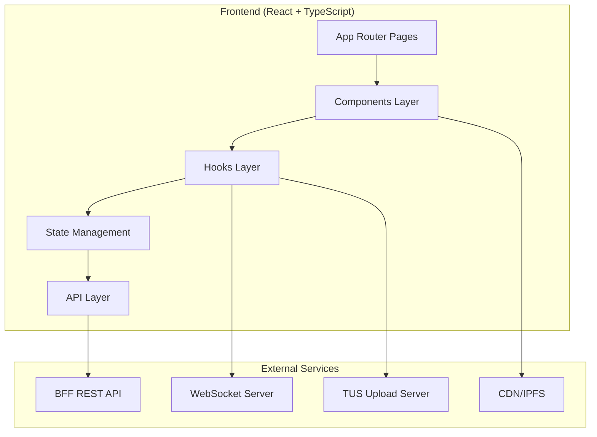

# Design Document

## Overview

The Web3 Content Platform Frontend is a modern React.js 18 application with TypeScript and React Router for client-side routing. It provides a YouTube × TikTok hybrid experience with walletless Web3 functionality. The application follows a headless client architecture, communicating with a Backend-for-Frontend (BFF) via REST APIs and WebSocket connections for real-time features.

The platform emphasizes performance, accessibility, and user experience while handling large file uploads (20GB+) and high-quality video streaming through HLS/LL-HLS protocols.

## Architecture

### High-Level Architecture



### Technology Stack

- **Framework**: React 18, TypeScript, React Router for client-side routing
- **Styling**: Tailwind CSS + Radix UI primitives + clsx for conditional classes
- **State Management**: Zustand for global state, @tanstack/react-query for server state
- **Forms**: react-hook-form + zod for validation
- **Media**: hls.js for HLS/LL-HLS video playback
- **Uploads**: tus-js-client for resumable uploads with IndexedDB persistence
- **Real-time**: socket.io-client for WebSocket connections
- **Utilities**: date-fns, lucide-react icons, idb-keyval for storage

### Folder Structure

The application follows React.js best practices with a clear separation of concerns:

```
src/
├── pages/             # React Router page components
│   ├── Home/          # Home page with mixed feed
│   ├── Shorts/        # Short-form video pages
│   ├── Watch/         # Video watch pages
│   ├── Upload/        # Upload workflow
│   ├── Wallet/        # Wallet management
│   ├── Studio/        # Creator dashboard
│   ├── Profile/       # User profile pages
│   └── Legal/         # Legal pages

components/            # Reusable UI components
├── comments/          # Comment system
├── compliance/        # Adult content compliance
├── feed/              # Content feeds
├── nav/               # Navigation components
├── player/            # Video players
├── studio/            # Creator tools
├── ui/                # Base UI components
├── upload/            # Upload workflow
└── wallet/            # Wallet components

hooks/                 # Custom React hooks
lib/                   # Utility functions
providers/             # React context providers
store/                 # Zustand stores
types/                 # TypeScript definitions
```

## Components and Interfaces

### Core Component Architecture

#### Navigation System
- **Header**: Global navigation with search, upload button, and wallet badge
- **SideNav**: Desktop sidebar with main navigation links
- **BottomNav**: Mobile bottom navigation for key actions

#### Video System
- **VideoPlayer**: HLS video player for long-form content with controls
- **ShortsPlayer**: Vertical video player for short-form content with gesture controls
- **ReactionBar**: Like, share, and tip interactions (horizontal/vertical layouts)

#### Content Discovery
- **FeedList**: Infinite scroll feed with mixed content types
- **VideoCard**: Video thumbnail with metadata display
- **ShortsCard**: Vertical video preview card
- **UpNextList**: Recommended content sidebar

#### Upload Workflow
- **UploadDropzone**: Drag-and-drop file selection with file validation
- **UploadProgress**: Real-time upload progress with resume capability
- **VideoDetailsForm**: Metadata input form with validation
- **VisibilitySelector**: Content visibility settings
- **PublishSummary**: Final review before publishing

#### Wallet Integration
- **WalletBadge**: Header wallet status and balance display
- **USDCBalance**: Detailed balance view with transaction history
- **TipButton**: Tip initiation with amount selection
- **TipSheet**: Modal tip interface with preset amounts
- **OnRampButton**: Fiat-to-crypto conversion entry point
- **WithdrawDialog**: Withdrawal interface with KYC validation

#### Creator Tools
- **ContentTable**: Creator's uploaded content management
- **EarningsSummary**: Revenue analytics and payout information
- **PayoutHistoryTable**: Historical payout records
- **KYCStatusCard**: KYC verification status and actions
- **GeoRestrictionEditor**: Country-based content blocking interface
- **WatermarkToggle**: Forensic watermark enablement control

#### Compliance System
- **AgeGate**: 18+ age verification modal with persistent consent
- **ReportButton**: Content reporting interface with moderation queue
- **Compliance2257Step**: ID verification and model release workflow
- **ComplianceStatusCard**: 2257 compliance status display

### State Management Strategy

#### Global State (Zustand)
- **Session Store**: User authentication and profile data
- **UI Store**: Theme preferences, modal states, navigation state

#### Server State (@tanstack/react-query)
- **Content Queries**: Video feeds, search results, video details
- **User Queries**: Profile data, wallet balance, earnings
- **Upload Mutations**: File upload progress and metadata submission
- **Interaction Mutations**: Tips, likes, follows with optimistic updates

#### Local State (React hooks)
- **Form State**: react-hook-form for complex forms with validation
- **Media State**: Video player controls and playback state
- **Upload State**: File selection, progress tracking, resume tokens

## Data Models

### Content Models

```typescript
interface Video {
  id: string;
  title: string;
  description: string;
  hlsUrl: string;
  poster: string;
  durationSec: number;
  durationLabel: string;
  views: number;
  likes: number;
  tips: number;
  createdAt: string;
  updatedAt: string;
  creator: Creator;
  tags: string[];
  visibility: 'public' | 'unlisted' | 'draft' | 'under_review' | 'dmca_hidden';
  type: 'long' | 'short';
  geoBlocked?: string[];
  forensicWatermark?: boolean;
  adultContent?: boolean;
}

interface Creator {
  id: string;
  handle: string;
  displayName: string;
  avatar?: string;
  verified: boolean;
  followerCount: number;
  totalViews: number;
  kycStatus?: 'pending' | 'approved' | 'rejected';
  requires2257?: boolean;
}
```

### Wallet Models

```typescript
interface WalletBalance {
  usdc: number;
  pendingEarnings: number;
  availableForWithdraw: number;
  lastUpdated: string;
}

interface TipTransaction {
  id: string;
  amount: number;
  currency: 'USDC';
  videoId: string;
  creatorId: string;
  timestamp: string;
  status: 'pending' | 'completed' | 'failed';
}
```

### Upload Models

```typescript
interface UploadSession {
  id: string;
  file: File;
  tusUrl?: string;
  progress: number;
  status: 'uploading' | 'processing' | 'completed' | 'failed';
  metadata: VideoMetadata;
}

interface VideoMetadata {
  title: string;
  description: string;
  tags: string[];
  visibility: 'public' | 'unlisted' | 'draft';
  thumbnail?: string;
  adultContent?: boolean;
  geoBlocked?: string[];
  forensicWatermark?: boolean;
}

interface ComplianceModels {
  interface AgeVerification {
    acknowledged: boolean;
    timestamp: number;
    ipAddress: string;
    userAgent: string;
  }

  interface ContentReport {
    id: string;
    videoId: string;
    reporterId?: string;
    reason: 'csam' | 'non-consensual' | 'copyright' | 'other';
    details: string;
    status: 'pending' | 'reviewed' | 'resolved';
    createdAt: string;
  }

  interface KYCVerification {
    status: 'pending' | 'approved' | 'rejected';
    documentType: 'drivers_license' | 'passport' | 'national_id';
    verificationDate?: string;
    expiryDate?: string;
    modelReleaseStatus: 'pending' | 'signed' | 'expired';
  }
}
```

## Error Handling

### API Error Handling
- **Network Errors**: Automatic retry with exponential backoff
- **Authentication Errors**: Redirect to login with return URL
- **Validation Errors**: Form-level error display with field highlighting
- **Rate Limiting**: User-friendly messages with retry suggestions

### Upload Error Handling
- **Connection Failures**: Automatic resume with progress preservation
- **File Validation**: Pre-upload validation with clear error messages
- **Storage Failures**: Graceful degradation with manual retry options
- **Processing Errors**: Status updates with support contact information

### Real-time Error Handling
- **WebSocket Disconnection**: Automatic reconnection with exponential backoff
- **Message Failures**: Fallback to polling for critical updates
- **Timeout Handling**: User notification with manual refresh option

### User Experience Error Handling
- **Toast Notifications**: Non-intrusive error and success messages
- **Loading States**: Skeleton screens and progress indicators
- **Offline Support**: Basic functionality with service worker caching
- **Graceful Degradation**: Feature availability based on connectivity

## Testing Strategy

### Unit Testing
- **Component Testing**: React Testing Library for component behavior
- **Hook Testing**: Custom hook testing with act() and renderHook()
- **Utility Testing**: Pure function testing with Jest
- **State Testing**: Zustand store testing with mock providers

### Integration Testing
- **API Integration**: MSW (Mock Service Worker) for API mocking
- **Upload Flow**: End-to-end upload workflow testing
- **Real-time Features**: WebSocket mock testing
- **Form Validation**: Complete form submission workflows

### End-to-End Testing
- **Critical Paths**: Video upload, playback, and tipping workflows
- **Cross-browser**: Chrome, Firefox, Safari compatibility
- **Mobile Testing**: Responsive design and touch interactions
- **Performance Testing**: Core Web Vitals and loading metrics

### Accessibility Testing
- **Screen Reader**: NVDA/JAWS compatibility testing
- **Keyboard Navigation**: Tab order and focus management
- **Color Contrast**: WCAG AA compliance verification
- **Motion Preferences**: Respect for reduced motion settings

## Performance Considerations

### Video Streaming Optimization
- **HLS Adaptive Bitrate**: Automatic quality adjustment based on bandwidth
- **Preloading Strategy**: Metadata preloading with lazy poster loading
- **CDN Integration**: Optimized delivery through global CDN network
- **Buffer Management**: Intelligent buffering for smooth playback

### Upload Performance
- **Chunked Uploads**: 8MB chunks for optimal network utilization
- **Resume Capability**: IndexedDB persistence for upload state
- **Background Processing**: Service worker integration for background uploads
- **Progress Optimization**: Real-time progress updates without blocking UI

### Application Performance
- **Code Splitting**: React Router route-based and component-based lazy loading
- **Image Optimization**: Responsive image components with WebP support
- **Bundle Optimization**: Vite/Webpack tree shaking and dynamic imports
- **Caching Strategy**: React Query caching with stale-while-revalidate

### Mobile Performance
- **Touch Optimization**: Gesture handling for shorts navigation
- **Battery Efficiency**: Optimized video playback and background processing
- **Network Awareness**: Adaptive loading based on connection quality
- **Memory Management**: Efficient component unmounting and cleanup

## Adult Content Compliance Architecture

### Age Verification System
- **Persistent Consent**: LocalStorage-based age acknowledgment with 90-day TTL
- **Regional Compliance**: Conditional ID verification for restricted jurisdictions
- **Privacy Protection**: Minimal data collection with secure transmission
- **Accessibility**: Screen reader compatible age gate with clear language

### Content Moderation Pipeline
- **Report Interface**: User-friendly reporting with categorized violation types
- **Moderation Queue**: Backend integration for content review workflow
- **Visibility Controls**: Granular content state management (public/hidden/review)
- **Appeal Process**: Creator-facing dispute resolution interface

### 2257 Compliance Workflow
- **ID Verification**: Third-party integration for government document scanning
- **Model Release**: Digital signature collection with legal document storage
- **Status Tracking**: Real-time verification status with creator notifications
- **Renewal Management**: Automated expiry tracking and renewal prompts

### Geo-Restriction Implementation
- **Country Blocking**: Per-video geographic restriction configuration
- **CDN Integration**: Edge-level enforcement with fallback detection
- **User Experience**: Friendly blocked content messaging with alternatives
- **Creator Tools**: Intuitive country selection interface with bulk operations

### Forensic Watermarking
- **Session Tracking**: Unique viewer session identification for watermark generation
- **Creator Controls**: Per-video and account-level watermark preferences
- **Performance Impact**: Minimal client-side processing with server-side generation
- **Privacy Balance**: User anonymity preservation with accountability measures

### Escrow and Payment Compliance
- **Tip Escrow**: 3-day holding period with admin override capabilities
- **Dispute Resolution**: Creator and admin interfaces for payment disputes
- **Compliance Reporting**: Automated transaction reporting for regulatory requirements
- **Fraud Prevention**: Pattern detection and automated risk assessment

### Legal Page Integration
- **DMCA Policy**: Comprehensive takedown procedure documentation
- **Terms of Service**: Adult platform specific terms with clear consent language
- **Privacy Policy**: Data handling practices for sensitive compliance information
- **Footer Integration**: Prominent legal page linking throughout the application

### Environment Configuration
```typescript
// Environment variables for React application
REACT_APP_API_BASE=https://bff.example.com
REACT_APP_WS_URL=wss://ws.example.com
REACT_APP_CDN_BASE=https://cdn.example.com
REACT_APP_UPLOAD_TUS_ENDPOINT=https://upload.example.com/files/
REACT_APP_IPFS_GATEWAY=https://cloudflare-ipfs.com/ipfs/
REACT_APP_FEATURE_FLAGS=shorts,live,watermark
REACT_APP_ADULT=1
REACT_APP_AGE_GATE_TTL_DAYS=90
REACT_APP_KYC_PROVIDER_URL=https://kyc.example.com
REACT_APP_GEO_BLOCK_API=https://geo.example.com
REACT_APP_WATERMARK_ENDPOINT=https://watermark.example.com
REACT_APP_COMPLIANCE_REGION=US
```

### Compliance Testing Strategy
- **Age Gate Testing**: Automated consent flow validation across browsers
- **Report Flow Testing**: End-to-end moderation workflow verification
- **KYC Integration**: Mock verification service testing with various document types
- **Geo-blocking**: VPN-based testing for geographic restriction enforcement
- **Watermark Validation**: Session uniqueness and watermark application verification